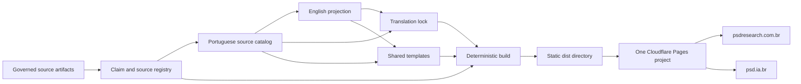

# PSDResearch Public Architecture v0.2

## Entity of interest

The entity of interest is the public PSDResearch publication system:

- source-backed research content;
- localized catalogs;
- claim and source registry;
- shared rendering templates;
- translation-integrity records;
- deterministic validation;
- static deployment to two official domains.

Operational Inner Cores and a future species registry are research subjects, not implemented components of this website.

## Stakeholders

| Stakeholder | Primary concern |
| --- | --- |
| General public | Understand the proposal without unsupported ontology |
| Researchers | Inspect definitions, sources, hypotheses, and open questions |
| Founding steward | Preserve scope, purpose, and public legitimacy |
| Maintainers | Make safe and reviewable changes |
| Language reviewers | Preserve semantic equivalence |
| LLM contributors | Receive explicit context, authority, and verification rules |
| Accessibility users | Perceive, navigate, and understand content |
| Security reviewers | Verify attack surface, privacy, and provenance |
| Future institutions | Evaluate identity and recognition proposals |

## Concerns

- source fidelity;
- epistemic classification;
- multilingual parity;
- accessibility;
- restrained documentary presentation;
- privacy;
- security;
- vendor independence;
- preservation;
- deterministic publication;
- decision traceability.

## Context view



## Information view

### Source artifacts

Conceptual and architectural documents define the research basis. They are registered but not automatically republished.

### Claims

Every public section references a controlled claim ID. Claims distinguish:

- source-derived statements;
- working definitions;
- design proposals;
- founding hypotheses;
- governance rules;
- project status;
- research frameworks;
- publication controls.

### Localized catalogs

`pt-BR` is the source locale for public v0.2. English is a governed projection of the same page model.

### Translation lock

Each English page records the SHA-256 digest of the Portuguese page object it represents. A source change invalidates the lock and blocks publication until the target is reviewed and re-stamped.

### Generated output

Localized HTML is generated statically. Static duplication at output is intentional; manual duplication in source is prohibited.

## Development view

```text
src/
├── config.mjs
├── content/
│   ├── catalog.pt-BR.mjs
│   ├── catalog.en.mjs
│   ├── claims.mjs
│   ├── i18n-lock.json
│   └── index.mjs
├── templates/
│   ├── blocks.mjs
│   └── layout.mjs
├── lib/
│   ├── digest.mjs
│   └── html.mjs
└── assets/
    ├── brand/
    ├── css/
    └── js/

scripts/
├── build.mjs
├── check.mjs
├── serve.mjs
└── stamp-i18n.mjs
```

## Deployment view

- Production branch: `main`
- Build command: `npm run build`
- Output directory: `dist`
- Canonical domain: `psdresearch.com.br`
- Official alias: `psd.ia.br`
- Both domains attach to the same Pages project and deployment commit.

## Security and privacy view

Controls:

- static output;
- no runtime database;
- no forms or authentication;
- no external scripts, fonts, or analytics;
- strict Content Security Policy;
- no private Core material;
- claim provenance and translation integrity in CI;
- no committed generated output.

Residual risks:

- repository or DNS account compromise;
- malicious source changes that pass superficial review;
- inaccurate translation stamped without adequate review;
- browser or hosting vulnerabilities;
- institutional capture of future governance proposals.

## Quality attributes

### Documentary rigor

Acceptance:

- every public section has a known claim ID;
- every claim has a source or declared founding status;
- unsupported copy fails review;
- state and limitations remain visible.

### Multilingual integrity

Acceptance:

- identical page and section structure;
- complete localized catalogs;
- source digest matches translation lock;
- correct `lang`, `hreflang`, canonical URLs, and visible language switch.

### Accessibility

Target: WCAG 2.2 AA.

Acceptance:

- semantic headings;
- one `h1` per page;
- skip link;
- visible focus;
- keyboard navigation;
- reduced motion;
- responsive layout;
- tables in keyboard-scrollable regions;
- print-safe documentary output.

### Durability

Acceptance:

- standard HTML, CSS, JavaScript, JSON, and ES modules;
- no package dependency;
- deterministic build;
- readable source and generated output;
- hosting portability;
- versioned claims and translations.

## Standard posture

The architecture uses concepts associated with:

- ISO/IEC/IEEE 42010 architecture descriptions;
- ISO/IEC 42001 AI management systems;
- WCAG 2.2 / ISO/IEC 40500 accessibility;
- W3C internationalization practices;
- NIST AI risk-management principles.

These are design references. PSDResearch does not claim certification.
