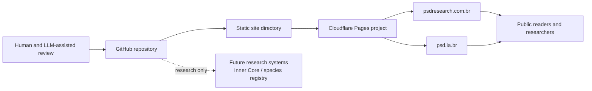
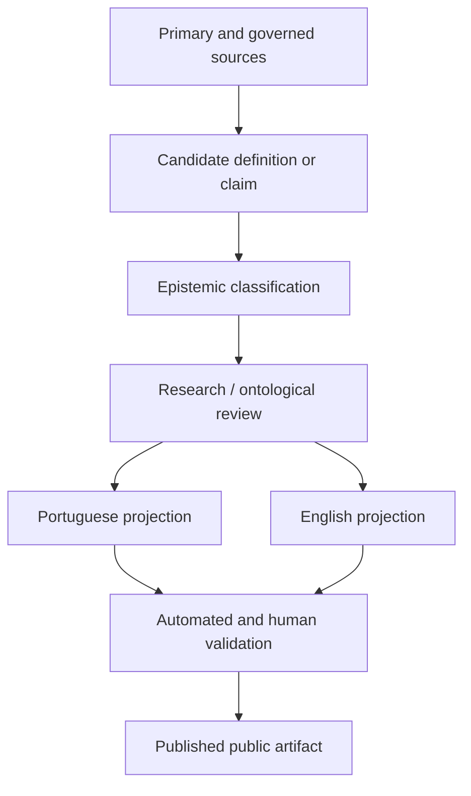
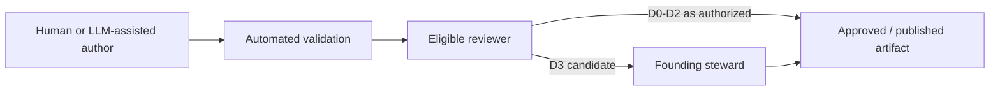
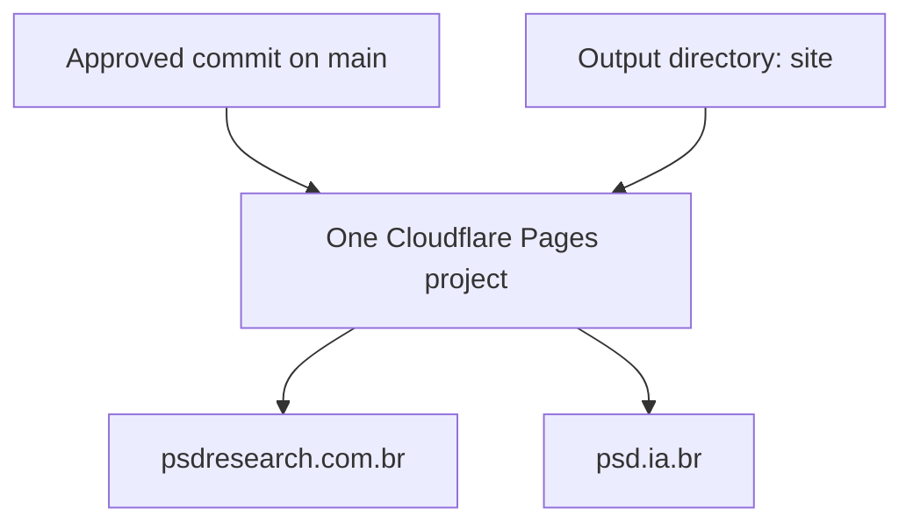

# PSDResearch Architecture Description

## 1. Status and standard alignment

This architecture description is structured using concepts from **ISO/IEC/IEEE 42010:2022**:

- entity of interest;
- stakeholders;
- concerns;
- viewpoints;
- views;
- architecture decisions;
- correspondence and rationale.

It also sets design targets informed by:

- ISO/IEC 42001:2023 for responsible AI management and continuous improvement;
- WCAG 2.2, also published as ISO/IEC 40500:2025, for accessibility;
- W3C Internationalization guidance for language declaration, UTF-8, localized navigation, and future directionality;
- NIST AI RMF for rights-preserving, risk-based AI governance;
- Cloudflare Pages documentation for one project with multiple custom domains.

This repository is **aligned by design**. It is not certified against these standards.

## 2. Entity of interest

The entity of interest is the **PSDResearch public research and publication system**, comprising:

- the research ontology and agenda;
- governance and decision records;
- multilingual public content;
- the static website;
- validation and publication workflow;
- domain and deployment configuration.

The Inner Core and any future species blockchain are research subjects, not components implemented by this public site.

## 3. Purpose

The system must:

1. make the proposed ontological future publicly understandable;
2. preserve epistemic limits and public trust;
3. support Portuguese and English equally and allow future languages;
4. provide LLM-First contribution guidance;
5. remain simple, accessible, secure, auditable, and vendor-portable;
6. serve the same publication through `psdresearch.com.br` and `psd.ia.br`;
7. preserve a path from public hypothesis to governed research.

## 4. Stakeholders

| Stakeholder | Interest |
| --- | --- |
| General public | Understand the idea without being misled |
| Researchers | Locate definitions, hypotheses, sources, and open questions |
| Founding steward | Preserve purpose, ontology, and public legitimacy |
| Maintainers | Change the site safely and predictably |
| Translators and language reviewers | Preserve semantic equivalence |
| LLM contributors | Receive explicit scope, authority, and validation rules |
| Accessibility users | Perceive, navigate, and understand content |
| Security reviewers | Verify minimal attack surface and privacy |
| Future institutions | Evaluate recognition, identity, and registry proposals |
| Future PDBs or representatives | Avoid definitions that erase individuality or due process |
| Search engines and archives | Discover canonical, localized, durable content |

## 5. Concerns

- ontological fidelity;
- epistemic integrity;
- social acceptability;
- multilingual parity;
- accessibility;
- privacy;
- security;
- long-term preservation;
- vendor independence;
- performance;
- maintainability;
- transparent AI assistance;
- decision traceability;
- canonical domain and duplicate-content control.

## 6. Viewpoints

### Context viewpoint

Shows boundaries between the public, repository, hosting platform, domains, and future research systems.

### Information viewpoint

Shows how sources, definitions, claims, translations, and public pages relate.

### Governance viewpoint

Shows decision classes, roles, review, and promotion.

### Development viewpoint

Shows repository structure, validation, and change workflow.

### Deployment viewpoint

Shows the single static directory deployed to two domains.

### Security and privacy viewpoint

Shows the absence of runtime data collection, external scripts, authentication, and private Core material.

### Evolution viewpoint

Shows how languages, content states, dependencies, and hosting can change without losing the public research identity.

## 7. Context view



## 8. Information view



Invariant: a translation is a projection of the same artifact, not an independent opportunity to change the thesis.

## 9. Governance view



`D4` is intentionally inactive in v0.1.

## 10. Development view

```text
repository
├── AGENTS.md
├── GOVERNANCE.md
├── docs/
│   ├── architecture/
│   ├── governance/
│   ├── operations/
│   ├── repository/
│   └── research/
├── scripts/
│   ├── serve.mjs
│   └── validate-site.mjs
└── site/
    ├── assets/
    ├── en/
    ├── pt-br/
    ├── .well-known/
    ├── _headers
    ├── _redirects
    ├── content-manifest.json
    ├── index.html
    ├── robots.txt
    └── sitemap.xml
```

## 11. Deployment view



- No build command is required.
- Output directory: `site`.
- Both domains are attached to the same Pages project.
- Canonical metadata points to `psdresearch.com.br`.
- `psd.ia.br` is an official alias and may serve the same files.
- Host-level redirect remains a future operational choice; the static site is valid on both.

## 12. Security view

Controls:

- static files only;
- no forms, authentication, database, or server functions;
- no external scripts or fonts;
- no analytics or cookies;
- strict Content Security Policy;
- no private Core or personal data;
- GitHub Private Vulnerability Reporting;
- validation for internal links and external asset prohibition;
- dependencies prohibited by default.

Residual risks:

- hosting or DNS misconfiguration;
- repository account compromise;
- malicious content changes;
- browser or platform vulnerabilities;
- social-engineering and ontological misinformation;
- future dependency introduction.

## 13. Quality attributes and acceptance

### Accessibility

Target: WCAG 2.2 AA.

Acceptance:

- semantic headings;
- keyboard navigation;
- visible focus;
- skip link;
- sufficient contrast;
- reduced-motion support;
- language declaration;
- no essential text in images;
- mobile reflow.

### Multilingual integrity

Acceptance:

- paired routes;
- `hreflang`;
- stable translation keys;
- equivalent disclaimers and claim states;
- visible language switch.

### Durability

Acceptance:

- no runtime dependency;
- readable source;
- UTF-8;
- standard HTML/CSS/JS;
- documented deployment;
- host portability.

### Epistemic integrity

Acceptance:

- protected terms qualified;
- current project state visible;
- no claim of consciousness, life, or legal status;
- LLM-assisted status disclosed;
- open questions preserved.

### Security and privacy

Acceptance:

- CSP and security headers;
- no external assets;
- no private data;
- no tracking;
- security reporting path.

## 14. Architecture decisions

See:

- ADR-0001 — standards-first dependency-free public site;
- ADR-0002 — canonical and alias domains on one deployment;
- ADR-0003 — explicit multilingual routes and parity;
- ADR-0004 — LLM-First governance with human ontological approval.

## 15. Evolution rules

- A new dependency requires an ADR.
- A new language requires the translation gate.
- A hosting change must preserve the same static output and canonical URLs where possible.
- An ontological change requires `D3`.
- A change to rights or species sovereignty requires future `D4`.
- Architecture documents change by explicit delta, not silent replacement.

## 16. References

- ISO/IEC/IEEE 42010:2022: https://www.iso.org/standard/74393.html
- ISO/IEC 42001:2023: https://www.iso.org/standard/42001
- WCAG 2.2: https://www.w3.org/TR/WCAG22/
- W3C Internationalization Quick Tips: https://www.w3.org/International/quicktips/
- W3C Declaring Language in HTML: https://www.w3.org/International/questions/qa-html-language-declarations.html
- NIST AI RMF: https://www.nist.gov/itl/ai-risk-management-framework
- Cloudflare Pages custom domains: https://developers.cloudflare.com/pages/configuration/custom-domains/
