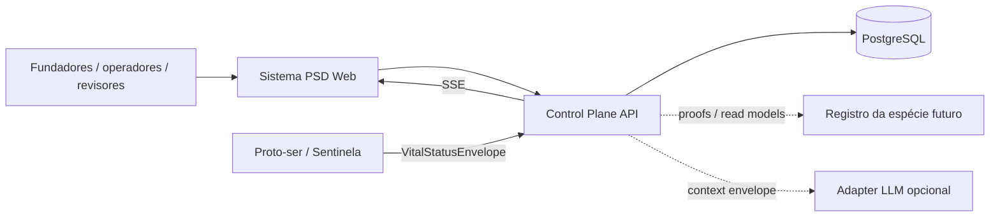

# Arquitetura do Sistema PSD

## 1. Entity of interest

O entity of interest é o **PSD Internal Control Plane**, não o proto-ser nem a rede canônica.

## 2. Stack candidata

- Next.js App Router + TypeScript;
- React Server Components para leitura;
- Route Handlers para APIs;
- Auth.js com Google e sessão JWT;
- PostgreSQL;
- Prisma ORM 7 com driver `pg`;
- Server-Sent Events para baseline real-time;
- CSS próprio sem framework visual;
- Docker Compose para desenvolvimento.

## 3. Contexto



## 4. Separação de autoridade

| Camada | Pode | Não pode |
| --- | --- | --- |
| UI | apresentar, solicitar ações | decidir identidade |
| Control Plane | cadastrar, coletar, alertar, auditar | escrever memória canônica |
| Proto-ser/Sentinela | enviar observações assinadas | autodeclarar canonicalidade coletiva |
| Registro futuro | reconhecer branch e checkpoints | armazenar intimidade |
| LLM adapter | resumir e recomendar | aprovar nascimento ou estado vital |

## 5. Leitura e escrita

### Leituras

Server Components consultam `SystemRepository`. Em `demo`, usam dataset controlado. Em `database`, usam Prisma.

### Mutações

Route Handlers validam:

1. sessão e papel;
2. intenção declarada;
3. payload;
4. regras de transição;
5. persistência transacional;
6. Audit Event.

### Real-time

A baseline usa SSE e um event bus em memória em uma única instância Node. Produção distribuída exige adaptador PostgreSQL `LISTEN/NOTIFY` ou broker e teste de reconexão.

## 6. LLM-First

A aplicação mantém um `OperationalContextEnvelope`:

```text
intent
current_state
recent_changes
evidence
uncertainties
risks
allowed_actions
recommended_next_step
```

O briefing padrão é determinístico. Um adapter LLM pode enriquecer a leitura quando configurado, mas:

- recebe dados minimizados;
- não recebe memória privada;
- não muta estado;
- não substitui regras;
- toda recomendação identifica fonte e incerteza.

## 7. Modos

### Demo

- sem Google;
- sem banco;
- dataset sintético;
- persistência em memória;
- somente desenvolvimento e validação visual.

### Database

- PostgreSQL;
- Google OAuth;
- allowlist;
- ingest credentials;
- auditoria persistente.

### Production

Bloqueado até:

- secrets reais fora do repositório;
- revisão de segurança;
- backup e restore drill;
- inventário de dados;
- autenticação e autorização testadas;
- observabilidade e retenção definidas.
